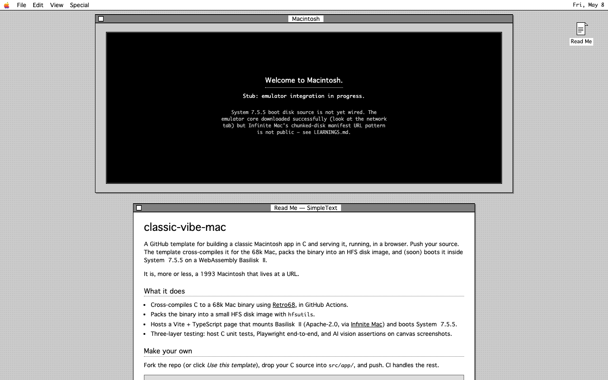

# classic-vibe-mac

A GitHub template for building a classic Macintosh app in C and serving it,
running, in a browser. Push your source. The template compiles it for the 68k
Mac, packs the binary into an HFS disk image, and (soon) boots it inside
System 7.5.5 on a WebAssembly Basilisk II.

It is, more or less, a 1993 Macintosh that lives at a URL.

## What it looks like



## What it does

- Cross-compiles C source to a 68k Mac binary using **Retro68**, in GitHub
  Actions, in a clean container.
- Packs the binary into a small HFS disk image with `hfsutils`.
- Hosts a Vite + TypeScript page that will mount **Basilisk II** (compiled to
  WebAssembly by the Infinite Mac project) and boot System 7.5.5.
- Ships a three-layer test setup: host C unit tests for game logic,
  Playwright end-to-end tests against the dev server, and AI vision
  assertions on canvas screenshots (because pixel-diffing an emulated CRT
  is a losing game).
- Comes with a Minesweeper clone in progress as the demo app and proof
  that the pipeline works end to end.

## How to use it

A live demo will live at the GitHub Pages URL once the emulator integration
lands. Until then, run it locally:

```sh
git clone https://github.com/your-fork/classic-vibe-mac.git
cd classic-vibe-mac
npm install
npm run dev
```

Open `http://localhost:5173`. Today you get the landing page with the
emulator window stubbed; once the BasiliskII core is wired in, the app
will boot inside it.

## Requirements

- A current desktop browser (Chrome, Firefox, Safari).
- For local development: Node 20+ and npm.
- No local emulator, no system disk, no ROM hunting. The build container
  brings the toolchain; the OS disk is fetched from Infinite Mac.

## How to make your own app

This repository is structured as a template — the demo app is a placeholder
for *your* app.

1. **Fork** this repository (or click "Use this template" on GitHub).
2. **Replace `src/app/`** with your own C source. Keep the `CMakeLists.txt`
   pattern; Retro68 expects an `add_application(YourApp your.c)` call.
3. **Push to `main`.** GitHub Actions builds the binary, packs the disk
   image, and (when the deploy job lands) publishes the result to GitHub
   Pages.
4. **Open your repo's Pages URL.** Your app, in the browser, on a Mac.

The web layer in `src/web/` doesn't usually need touching — it's the
"container" the OS boots in. Edit it if you want a different page chrome
around the emulator.

For architecture notes and milestones, see [PRD.md](./PRD.md). For the
log of things we learned the hard way, see [LEARNINGS.md](./LEARNINGS.md).

## Coming soon

- A working live demo at the GitHub Pages URL.
- Real Basilisk II integration (the worker is sketched; the canvas is not
  yet wired).
- In-browser auto-launch of the user's app at boot. The mechanism is
  understood (inject into the boot disk's blessed System Folder); the
  implementation is on the list.

## Credits

Built on the work of others who did the heavy lifting:

- **[Retro68](https://github.com/autc04/Retro68)** by Wolfgang Thaller and
  contributors — the cross-compiler that makes 68k Mac binaries from
  modern source.
- **[Infinite Mac](https://github.com/mihaip/infinite-mac)** by Mihai
  Parparita — Basilisk II and SheepShaver compiled to WebAssembly, plus
  the chunked disk-fetch infrastructure we're leaning on.
- **Basilisk II** by Christian Bauer and the open-source community — the
  68k Mac emulator that all of this rides on.
- **System 7.5.5** by Apple Computer, freely redistributed since 2001.
- **Susan Kare**, in spirit, for the icons that taught the world what
  computers were allowed to look like.

## License

MIT. The vendored emulator core (when added) is Apache-2.0 and carries
its own NOTICE file.
